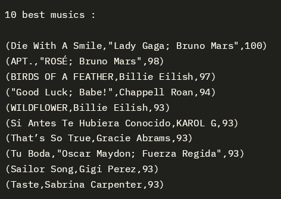
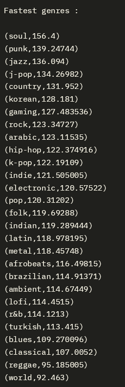
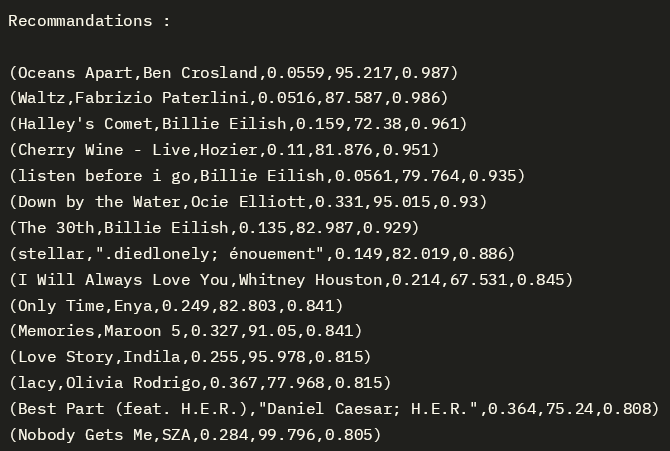

# Projet DMB : Analyse de musiques Spotify
## Dataset

Dans le cadre de ce projet, nous avons choisi de travailler sur un dataset de musiques Spotify, contenant les musiques les plus populaires sur l'année 2024. Le csv contient des informations sur de nombreux éléments des musiques : artiste, nom de la musique, tempo, genre, etc...

Nous avons trouvé notre dataset sur le site Kaggle.

## Analyse
L'objectif du projet était de répondre à trois questions sur le dataset, de difficulté croissante.
### Question 1 : Quelles sont les 10 musiques les plus populaires de 2024 ?

Pour répondre à cette question, nous commençons par créer un rdd contenant uniquement les colonnes nécessaires : titre de la musique, artiste(s), et popularité.
Ensuite, il nous suffit de trier la colonne popularité par ordre décroissant, avec la fonction `sortBy()`. Puis nous ne conservons que les 10 meilleures chansons, à l'aide de `take(10)`, et enfin nous affichons la liste obtenue.

Résultat :

### Question 2 : Quels sont les genres les plus rapides (tempo) ?
Nous commençons par créer deux rdd :
- un premier contenant le genre et le tempo,
- un second contenant le genre et une colonne avec uniquement des 1. Ce rdd va nous permettre de compter le nombre de chansons par genre.

Ensuite on procède à une réduction par genre, en utilisant `reduceByKey(_+_)`. Le premier rdd va donc contenir la somme des tempos pour un genre, et le second le nombre de chansons par genre.
Ces deux rdd vont ensuite nous permettre de calculer la moyenne des tempos pour un genre, en divisant la somme des tempos par le nombre de musiques.
Voici la commande que nous lançons :
```shell
val mean_popularity_by_key = total_popularity_by_key.map(p => (p._1, p._2 / nbr_music_by_key.filter(y => y._1 == p._1)(0)._2))
```

Pour finir, on trie les moyennes par ordre décroissant, et on affiche les genres du plus rapide au plus lent.
Résultat :

### Question 3 : Quelles musiques recommander en fonction des préférences de l'utilisateur ?
Pour cette question, nous avons choisi de demander à l'utilisateur de rentrer ses préférences concernant différentes composantes d'une musique (tempo, energy, acousticness), puis de lui recommander les musiques qui correspondent le mieux à ses choix.

Pour commencer, nous posons à l'utilisateur trois questions de ce format :
```shell
Which tempo do you prefer, fast (0), medium (1) or slow (2) ? :
```
Puis nous attendons sa réponse avec `readLine()`.

Ensuite nous créons un nouveau rdd avec les colonnes utiles : nom de la musique, artiste, tempo, energy et acousticness. Nous choississons aussi des valeurs pour chaque composante, de manière à pouvoir sélectionner les bonnes musiques. Par exemple : `slow_tempo = 100.0, fast_tempo = 150.0`.

L'étape suivante est de filtrer la liste de musiques en fonction des préférences de l'utilisateur. Pour cela nous faisons un pattern matching sur les valeurs qu'il a rentrées, et nous gardons uniquement les musiques correspondantes. Par exemple : `tempo = slow`, on ne garde que les musiques dont le tempo est inférieur à `low_tempo`. On utilise pour cela la fonction `filter()`.

Enfin, après avoir filtré notre ensemble en fonction des trois composantes tempo, energy et acousticness, nous affichons les maximum 20 recommendations restantes.

On peut noter que les filtrages se font à la suite : on termine toujours par filter l'acousticness, il est donc possible que les musiques les plus acoustiques aient déjà été filtrées dans une étape antérieure. Cependant les résultats correspondent tout de même globalement aux préférences de l'utilisateur.

Résultat : Recommandations de musiques lentes, peu énergiques, et acoustiques :

